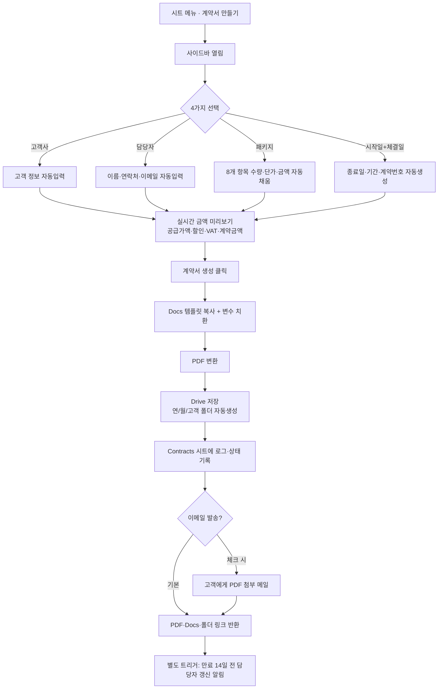

# 커넥트와이즈 계약서 자동화 시스템 — 설계서

> 직원이 **고객 · 담당자 · 패키지 · 날짜** 4가지만 선택하면
> 수량·단가·금액·공급가액·부가세·계약금액·기간·계약번호가 **전부 자동**으로 채워지고,
> Docs → PDF → Google Drive 저장 → (선택)이메일까지 3분 안에 끝나는 시스템입니다.

---

## 1. 타당성 분석 (Feasibility)

**결론: 네, 완전 자동화가 가능합니다.** 새로 만든 계약서는 아래 이유로 자동화에 이상적입니다.

| 근거 | 설명 |
|---|---|
| 구조가 고정적 | 당사자·용역표(8행)·금액·조항이 **틀이 고정**되어 있어 변수 치환 방식({{}})으로 100% 대응 |
| 변수가 소수 | 매번 바뀌는 값은 **고객·담당자·패키지·날짜 4종**뿐. 나머지(을 정보, 계약 조항, 계좌)는 상수 |
| 계산이 규칙적 | 금액 = 수량×단가, 공급가액=Σ금액, 계약금액=(공급-할인)×1.1 — 모두 **수식화 가능** |
| 패키지가 4개로 한정 | 4개 패키지(1·3·6·12개월)의 항목(각 5~6개)·수량·단가를 DB에 한 번만 넣으면 선택만으로 표 전체가 채워짐. 패키지마다 항목 구성·단가가 달라도 대응 |
| Google Workspace 네이티브 | Sheets(DB) + Docs(템플릿) + Apps Script(엔진) 조합으로 **추가 비용·외부 서버 없이** 구현 |

**한 가지 설계 판단:** 완전 무인 발송이 아니라 *"자동 생성 + 사람이 검토 후 발송"* 을 권장합니다.
계약서는 법적 문서라 최종 확인 1회는 남겨두는 것이 안전하며, 생성 자체가 자동이라 속도 이점은 그대로입니다.
(이메일 자동 발송은 체크박스로 켤 수 있게 옵션 제공)

---

## 2. 워크플로우 설계 (Workflow)



---

## 3. 데이터베이스 구조 (Google Sheets)

하나의 스프레드시트 안에 아래 **5개 탭**. 1행은 항상 헤더(컬럼명).
(시드 CSV 는 `data/` 폴더에 있으며 `Setup.gs → initSheets()` 가 탭·헤더를 자동 생성)

### 3.1 `SalesReps` — 영업 담당자
| rep_id | name | phone | email | department | active |
|---|---|---|---|---|---|
| REP-01 | 김수인 | 010-1234-4567 | sikim@… | 영업팀 | TRUE |

### 3.2 `Packages` — 패키지 헤더(요약 금액) · 실데이터
| package_id | package_name | duration_months | list_supply | discount | net_supply | vat | contract_total | active |
|---|---|---|---|---|---|---|---|---|
| PKG-1M | 동네확보 프로젝트 | 1 | 320,000 | 70,000 | 250,000 | 25,000 | 275,000 | TRUE |
| PKG-3M | 동네선점 프로젝트 | 3 | 800,000 | 50,000 | 750,000 | 75,000 | 825,000 | TRUE |
| PKG-6M | 동네점유 프로젝트 | 6 | 1,950,000 | 450,000 | 1,500,000 | 150,000 | 1,650,000 | TRUE |
| PKG-12M | 동네장악 프로젝트 | 12 | 4,500,000 | 1,500,000 | 3,000,000 | 300,000 | 3,300,000 | TRUE |

> `net_supply / vat / contract_total` 은 비워둬도 됩니다 → `Calc.gs` 가 자동 계산.
> 값을 채우면 그 값을 **우선 신뢰**(회계 담당이 정한 라운딩을 그대로 반영).

### 3.3 `PackageItems` — 패키지별 용역 라인 (패키지마다 5~6개, 항목·단가 상이)
| package_id | package_name | line_no | item_name | description | qty | unit | months | unit_price | amount |
|---|---|---|---|---|---|---|---|---|---|
| PKG-1M | 동네확보 프로젝트 | 1 | 비즈프로필 후기 | 좋은 후기로 고객 신뢰도 상승 | 5 | 개 | 1 | 5,000 | 25,000 |
| PKG-3M | 동네선점 프로젝트 | 1 | 비즈프로필 후기 | 좋은 후기로 고객 신뢰도 상승 | 60 | 개 | 3 | 6,000 | 360,000 |

> `months` 컬럼은 데이터로만 보관하고 **계약서 표에는 표기하지 않습니다**(계약기간에만 표시).

> 같은 항목이라도 **패키지마다 단가·수량이 다를 수 있습니다**(예: 후기 단가 5,000 vs 6,000).
> `line_no` 순서대로 문서 표에 채워지고, `amount` 는 비우면 `수량×단가` 로 자동 계산됩니다.

### 3.4 `Customers` — 고객사(선택 입력, 없으면 수동)
| customer_id | company | ceo | biz_no | address | phone | email |
|---|---|---|---|---|---|---|

### 3.5 `Contracts` — 생성 이력·상태 추적 (append-only 로그)
| contract_no | created_at | customer_id | company | rep_id | rep_name | package_id | package_name | supply | discount | vat | total | start_date | end_date | sign_date | status | pdf_url | doc_url |
|---|---|---|---|---|---|---|---|---|---|---|---|---|---|---|---|---|---|

> **확장(Pricing / DiscountRules)**: 지금은 `Packages`·`PackageItems` 두 탭이 단가표·할인 역할을 겸합니다.
> 향후 항목 단가를 패키지와 분리하고 싶으면 `Pricing(item_id, unit_price)` 탭을 추가하고
> `PackageItems` 는 `qty` 만 두면 됩니다. 할인 규칙이 복잡해지면 `DiscountRules(조건→할인율)` 탭을 추가해
> `Calc.gs` 의 discount 계산부만 교체하면 되도록 **계산 로직이 한 파일에 격리**되어 있습니다.

---

## 4. 변수 매핑 (Merge Fields)

Docs 템플릿에 아래 `{{키}}` 를 넣어두면 그대로 치환됩니다. 전체 정의는 `apps-script/VariableMapping.gs`.

| 변수 | 값 | 출처 |
|---|---|---|
| `{{계약번호}}` | CW-20260725-0001 | 자동생성 |
| `{{갑_상호}}` `{{갑_대표자}}` `{{갑_사업자번호}}` `{{갑_소재지}}` `{{갑_연락처}}` `{{갑_이메일}}` | 고객 정보 | Customers |
| `{{을_상호}}` `{{을_대표자}}` `{{을_사업자번호}}` `{{을_소재지}}` `{{을_연락처}}` `{{입금계좌}}` | 커넥트와이즈 고정 | Config |
| `{{담당부서}}` `{{담당자_이름}}` `{{담당자_연락처}}` `{{담당자_이메일}}` | 담당자 | SalesReps |
| `{{패키지명}}` | 동네확보 프로젝트 | Packages |
| `{{항목1_명}}`~`{{항목6_명}}`, `{{항목N_세부}}` `{{항목N_수량}}` `{{항목N_단가}}` `{{항목N_금액}}` | 용역표(최대 6행, 자동 증감) | PackageItems |
| `{{총공급가액}}` `{{패키지할인}}` `{{부가세}}` `{{총계약금액}}` `{{계약금액라벨}}` | 금액 (부가세 포함/별도 토글) | Calc.gs |
| `{{계약기간}}` `{{계약시작일}}` `{{계약종료일}}` `{{계약기간개월}}` | 기간 | 날짜 선택 |
| `{{계약체결일}}` | 2026년 7월 25일 | 날짜 선택 |

---

## 5. 수식 설계 (Formula)

계산은 `apps-script/Calc.gs` 한 곳에만 존재합니다(단일 진실 공급원).

```
라인 금액        = 수량 × 단가                      (공급가액 기준, VAT 별도)
총 공급가액      = Σ(라인 금액)                      = list_supply
할인 후 공급가액 = 총 공급가액 − 패키지 할인          = net_supply
부가세(VAT)      = round(할인후공급 × 10%, 1,000원)   = vat
총 계약금액      = 할인후공급 + 부가세                = contract_total  (VAT 포함, 최종 결제액)
```

실데이터 기준 (사장님 제공 견적표 4종과 **원 단위까지 일치** 확인):

| 패키지 | 기간 | 공급가액 | 할인 | 부가세 | **총 계약금액** |
|---|---|---:|---:|---:|---:|
| 동네확보 프로젝트 | 1개월 | 320,000 | −70,000 | 25,000 | **275,000** |
| 동네선점 프로젝트 | 3개월 | 800,000 | −50,000 | 75,000 | **825,000** |
| 동네점유 프로젝트 | 6개월 | 1,950,000 | −450,000 | 150,000 | **1,650,000** |
| 동네장악 프로젝트 | 12개월 | 4,500,000 | −1,500,000 | 300,000 | **3,300,000** |

> **부가세 표기 토글**: 위 '총 계약금액'은 VAT 포함 금액입니다. 계약서에서 부가세를
> 별도 줄로 보이고 싶으면 사이드바/패널의 **부가세 표기 = 별도**를 선택 → 부가세가 독립 줄로 표기됩니다.

> **패키지 선택이 바뀌면** 사이드바가 `previewPackage()` 를 다시 호출 → 표·합계가 즉시 갱신됩니다.
> **미래 확장**(여러 패키지 동시/추가 옵션): `computePackage()` 를 배열로 합산하도록 감싸면 되므로 수식은 그대로 확장됩니다.

---

## 6. UI/UX 권장 (신입도 3분 이내)

1. **선택 4개 + 버튼 1개** — 타이핑 필드를 없애고 전부 드롭다운/날짜 피커로. 오타·계산 실수 원천 차단.
2. **실시간 미리보기** — 패키지를 고르는 즉시 금액표가 사이드바에 떠서 "이 금액 맞나?" 를 생성 전 확인.
3. **날짜 피커 + 종료일 자동** — 시작일과 개월수만 → 종료일 자동. 개월수 기본값은 패키지에 내장.
4. **계약번호·파일명·폴더 자동** — 사람이 규칙을 외울 필요 없음.
5. **검증 후에만 버튼 활성화** — 필수값(담당자·패키지·시작일·체결일)이 없으면 생성 버튼 비활성.
6. **결과 링크 즉시 표시** — 생성 후 PDF·Docs·폴더 링크 3개를 사이드바에 바로 노출.

> 즉시 체험용으로 **`prototype/contract-interactive.html`** 를 브라우저로 열면
> Google 설정 없이도 위 UX 전체(드롭다운·패키지 자동채움·자동계산·날짜피커·PDF 인쇄)를 그대로 확인할 수 있습니다.

---

## 7. Apps Script 구현 계획

### 파일 구성
| 파일 | 역할 |
|---|---|
| `Config.gs` | 템플릿/폴더 ID·상수·을 정보 (배포 시 여기만 수정) |
| `Database.gs` | 시트 → 객체 배열 읽기 |
| `Calc.gs` | 금액 계산(단일 진실 공급원) |
| `Dates.gs` | 날짜·기간·계약번호 |
| `VariableMapping.gs` | 데이터 → {{변수}} 매핑 |
| `ContractGenerator.gs` | Docs 병합·PDF·Drive·이메일 |
| `Code.gs` | 메뉴·사이드바 핸들러·`createContract()` 오케스트레이션 |
| `Renewals.gs` | 만료 갱신 알림(일 트리거) |
| `Setup.gs` | 탭 자동생성·트리거 설치·설정 점검 |
| `Sidebar.html` | 입력 UI |

### 함수·트리거 흐름
- `onOpen()` → 커스텀 메뉴 생성
- `showSidebar()` → `Sidebar.html` 표시
- `getFormData()` → 드롭다운 데이터 공급
- `previewPackage(id)` → 실시간 금액 미리보기
- `createContract(payload)` → **핵심 오케스트레이션**:
  데이터 수집 → 날짜/계약번호 → 변수맵 → `generateDocuments()` → `logContract()` → (선택)`emailContract()`
- 시간 트리거 `checkRenewals()` → 매일 09:00 만료 임박 계약 담당자 알림

### 오류 처리
- `createContract()` 는 try/catch 로 감싸 `{ok:false, message}` 반환 → 사이드바가 사용자에게 표시
- `runSetupCheck()` 로 배포 전 템플릿/폴더 ID·탭·데이터 유무 사전 점검

### 권장 구현 순서
1. `data/` CSV 를 Sheets 5개 탭에 넣기 (`initSheets()` 로 헤더 자동생성 후 붙여넣기)
2. Docs 템플릿에 `{{변수}}` 배치 (`docs/03_변수매핑표.md` 참고) → `TEMPLATE_DOC_ID` 설정
3. 저장용 Drive 폴더 생성 → `ROOT_FOLDER_ID` 설정
4. Apps Script 9개 파일 붙여넣기 → 권한 승인
5. `runSetupCheck()` 로 점검 → 사이드바에서 테스트 생성
6. `installTriggers()` 로 갱신 알림 켜기

상세 단계는 **`docs/02_배포가이드.md`** 참고.
